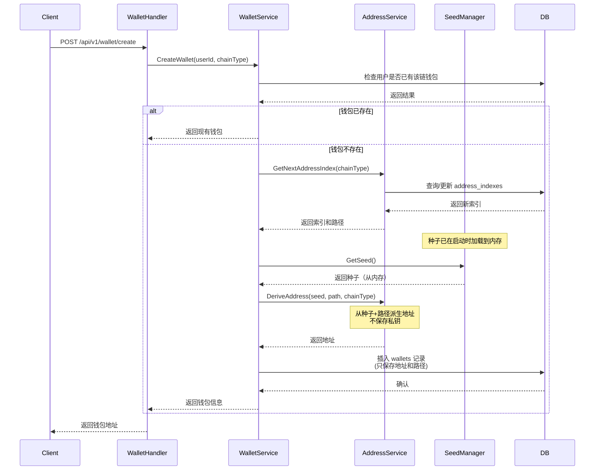
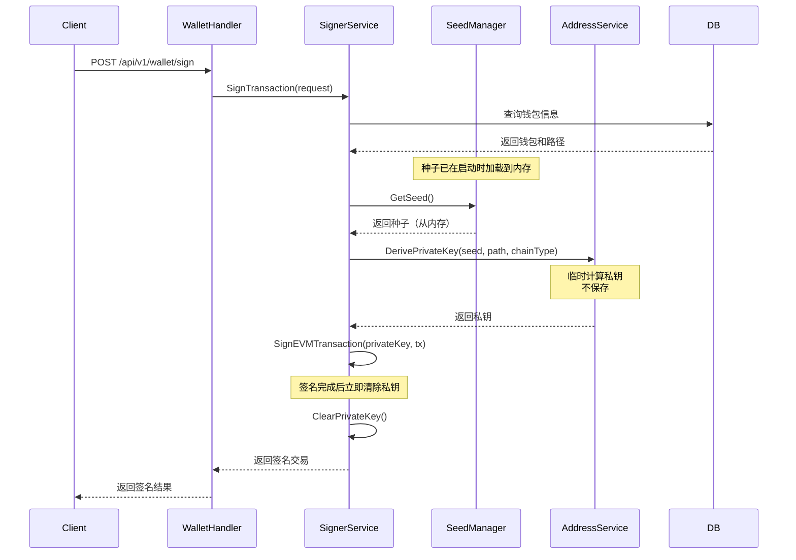
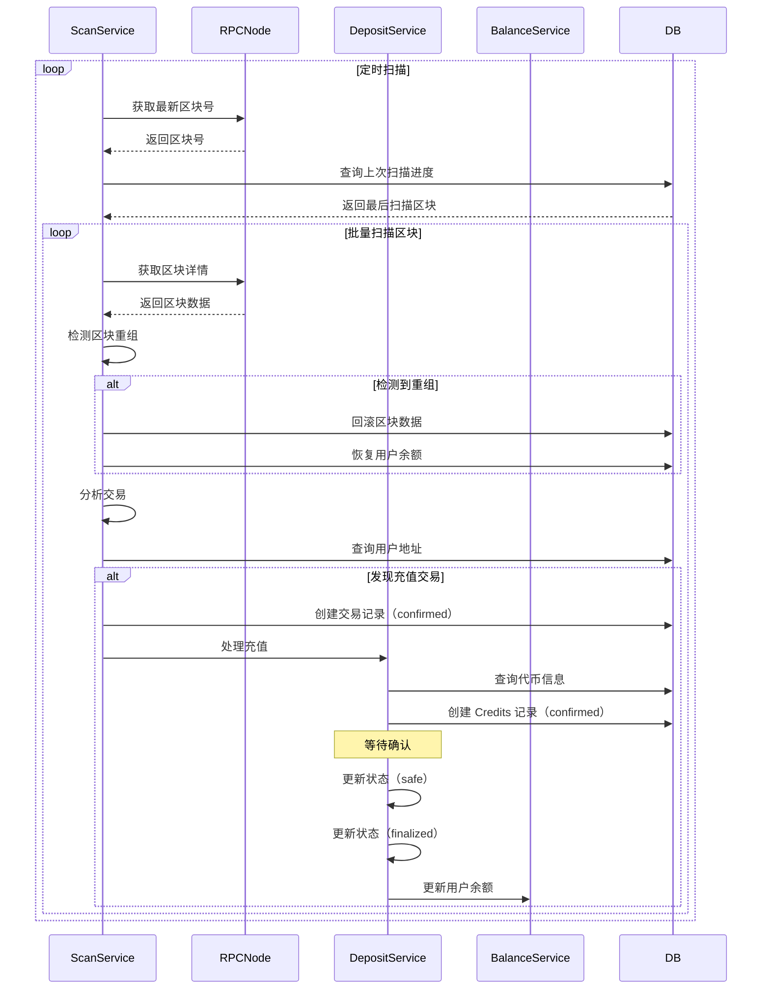
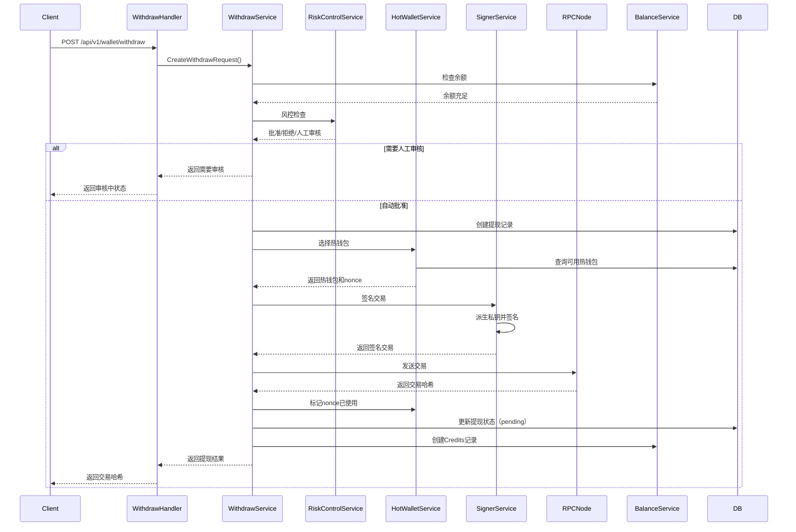
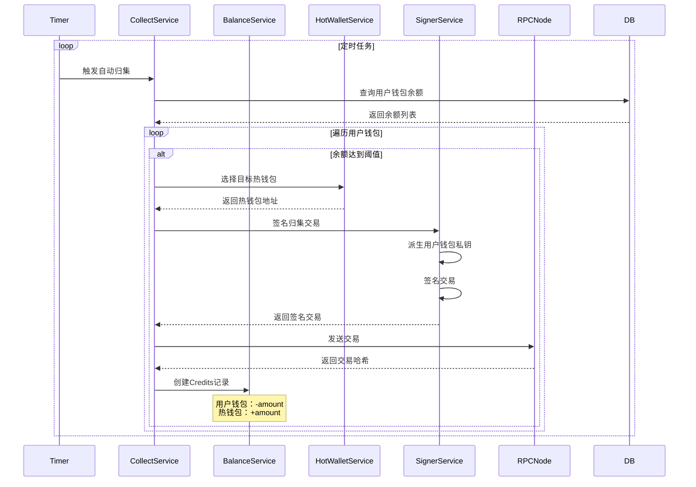

# 分层确定性钱包（HD Wallet）设计方案

## 1. 概述

本文档描述基于 go-starter 框架开发的分层确定性钱包（Hierarchical Deterministic Wallet, HD Wallet）系统的设计方案。该系统参考 cex-wallet 的设计理念，实现安全的密钥管理、地址生成、交易签名等核心功能，同时遵循 go-starter 的架构规范和最佳实践。

### 1.1 设计目标

- **安全性**：使用 keystore 加密存储单一助记词，启动时通过密码解锁
- **零私钥存储**：用户私钥不保存，需要时从种子临时派生，签名后立即清除
- **完整性**：实现完整的交易所钱包功能，包括充值、提现、归集、调度等
- **规范性**：严格遵循 go-starter 的架构模式和代码规范
- **可维护性**：清晰的分层架构，便于维护和测试
- **EVM 优先**：当前版本仅支持 EVM 链，后续可扩展其他链

### 1.2 核心设计理念

**关键原则**：
1. **单一种子源**：系统只保存一个加密的助记词（keystore），所有用户地址都从这个助记词派生
2. **启动时解锁**：服务启动时输入密码，从 keystore 解密助记词并生成种子，种子保存在内存中
3. **按需派生**：用户私钥不保存，需要签名时从种子+派生路径临时计算私钥
4. **即时清除**：私钥使用后立即从内存清除，不持久化
5. **元数据存储**：数据库只保存地址、派生路径、索引等元数据，不保存任何私钥信息

### 1.3 核心功能

1. **密钥管理**：使用 keystore 格式加密存储单一助记词，启动时密码解锁
2. **地址生成**：基于 BIP44 标准从种子派生地址（当前仅支持 EVM）
3. **交易签名**：签名时临时派生私钥，签名后立即清除
4. **地址索引管理**：自动管理地址派生路径和索引，确保地址唯一性
5. **充值（Deposit）**：区块链扫描、交易检测、确认机制、自动入账
6. **提现（Withdraw）**：完整提现流程、风控检查、热钱包选择、状态管理
7. **归集（Collect）**：用户钱包到热钱包的资金归集
8. **资金调度（Rebalance）**：热钱包之间的资金调度
9. **余额管理**：基于 Credits 流水表的余额查询和聚合
10. **热钱包管理**：热钱包创建、Nonce 管理、余额监控
11. **风控模块**：风险评估、双重签名验证、人工审核（可选，可集成外部服务）

## 2. 系统架构

### 2.1 整体架构图

```
┌─────────────────────────────────────────────────────────────┐
│                    HTTP API Layer                            │
│  (Echo Framework - internal/api/handlers/wallet/)           │
└───────────────────────┬─────────────────────────────────────┘
                        │
┌───────────────────────▼─────────────────────────────────────┐
│                  Service Layer                                │
│  ┌──────────────┐  ┌──────────────┐  ┌──────────────┐      │
│  │ Wallet       │  │ Scan         │  │ Risk Control │      │
│  │ Service      │  │ Service      │  │ Service      │      │
│  └──────────────┘  └──────────────┘  └──────────────┘      │
│  ┌──────────────┐  ┌──────────────┐  ┌──────────────┐      │
│  │ Deposit      │  │ Withdraw     │  │ Collect      │      │
│  │ Service      │  │ Service      │  │ Service      │      │
│  └──────────────┘  └──────────────┘  └──────────────┘      │
│  ┌──────────────┐  ┌──────────────┐  ┌──────────────┐      │
│  │ Rebalance    │  │ Balance      │  │ HotWallet    │      │
│  │ Service      │  │ Service      │  │ Service      │      │
│  └──────────────┘  └──────────────┘  └──────────────┘      │
│  ┌──────────────┐  ┌──────────────┐  ┌──────────────┐      │
│  │ Keystore     │  │ Seed         │  │ Address      │      │
│  │ Service      │  │ Manager      │  │ Service      │      │
│  └──────────────┘  └──────────────┘  └──────────────┘      │
│  ┌──────────────┐                                          │
│  │ Signer       │                                          │
│  │ Service      │                                          │
│  └──────────────┘                                          │
└───────────────────────┬─────────────────────────────────────┘
                        │
┌───────────────────────▼─────────────────────────────────────┐
│                  Model Layer                                 │
│  (SQLBoiler Generated - internal/models/)                    │
│  - wallets, keystore, address_indexes                       │
│  - transactions, credits, withdraws                         │
│  - blocks, tokens, wallet_nonces                           │
└───────────────────────┬─────────────────────────────────────┘
                        │
┌───────────────────────▼─────────────────────────────────────┐
│              Persistence Layer                                │
│  (PostgreSQL - internal/persistence/)                         │
└─────────────────────────────────────────────────────────────┘
                        │
┌───────────────────────▼─────────────────────────────────────┐
│              External Services                                │
│  - Ethereum RPC Node (扫描和查询)                            │
│  - Risk Control Service (可选，外部风控服务)                │
└─────────────────────────────────────────────────────────────┘
```

### 2.2 模块划分

#### 2.2.1 API 层 (internal/api/handlers/wallet/)

负责处理 HTTP 请求和响应，遵循 go-starter 的 handler 模式：

- `post_create_wallet.go` - 创建钱包
- `get_wallet_address.go` - 获取钱包地址
- `post_sign_transaction.go` - 签名交易
- `get_address_index.go` - 查询地址索引

#### 2.2.2 Service 层 (internal/wallet/)

核心业务逻辑层，包含以下服务：

**核心服务**：
- **WalletService**: 钱包管理核心服务
- **KeystoreService**: Keystore 加密/解密服务，管理单一助记词
- **SeedManager**: 种子管理器，启动时解锁种子并保存在内存中
- **AddressService**: 地址生成和管理服务
- **SignerService**: 交易签名服务，临时派生私钥并签名

**业务服务**：
- **ScanService**: 区块链扫描服务（EVM），扫描区块和检测交易
- **DepositService**: 充值处理服务，处理用户充值入账
- **WithdrawService**: 提现处理服务，处理用户提现流程
- **CollectService**: 归集服务，将用户钱包资金归集到热钱包
- **RebalanceService**: 资金调度服务，热钱包间资金调度
- **BalanceService**: 余额管理服务，基于 Credits 表的余额查询
- **HotWalletService**: 热钱包管理服务，热钱包创建和 Nonce 管理
- **RiskControlService**: 风控服务（可选），可集成外部风控服务

#### 2.2.3 Model 层 (internal/models/)

使用 SQLBoiler 生成的数据库模型：

**核心表**：
- `wallets` - 钱包信息表（只存储地址、路径等元数据）
- `keystore` - 单一 Keystore 存储表（存储加密的助记词）
- `address_indexes` - 地址索引表（管理地址派生索引）

**业务表**：
- `transactions` - 交易记录表（链上交易）
- `credits` - 资金流水表（所有余额变动）
- `withdraws` - 提现记录表（提现完整生命周期）
- `blocks` - 区块扫描进度表
- `tokens` - 代币信息表（EVM ERC20 代币）
- `wallet_nonces` - 钱包 Nonce 管理表（EVM 链交易排序）

#### 2.2.4 Persistence 层 (internal/persistence/)

数据库连接和基础操作封装。

## 3. 数据库设计

### 3.1 表结构设计

#### 3.1.1 wallets 表

存储钱包基本信息（**只存储元数据，不存储私钥**）：

```sql
CREATE TABLE wallets (
    id UUID PRIMARY KEY DEFAULT uuid_generate_v4(),
    user_id UUID NOT NULL REFERENCES users(id) ON DELETE CASCADE,
    address VARCHAR(255) NOT NULL,
    chain_type VARCHAR(50) NOT NULL, -- 'evm', 'solana', 'btc'
    derivation_path VARCHAR(255) NOT NULL, -- BIP44 路径，如 "m/44'/60'/0'/0/0"
    address_index INTEGER NOT NULL, -- 地址索引
    wallet_type VARCHAR(50) NOT NULL DEFAULT 'user', -- 'user', 'hot', 'cold'
    device_name VARCHAR(255), -- 设备名称（可选）
    created_at TIMESTAMPTZ NOT NULL DEFAULT NOW(),
    updated_at TIMESTAMPTZ NOT NULL DEFAULT NOW(),
    CONSTRAINT wallets_user_chain_unique UNIQUE (user_id, chain_type)
);

CREATE INDEX idx_wallets_user_id ON wallets(user_id);
CREATE INDEX idx_wallets_address ON wallets(address);
CREATE INDEX idx_wallets_chain_type ON wallets(chain_type);
```

**重要说明**：此表只存储地址、路径等元数据，**不存储任何私钥信息**。

#### 3.1.2 keystore 表

存储**单一加密的助记词**（系统级，不是每个用户一个）：

```sql
CREATE TABLE keystore (
    id UUID PRIMARY KEY DEFAULT uuid_generate_v4(),
    keystore_data JSONB NOT NULL, -- 加密的助记词 keystore JSON 数据
    version INTEGER NOT NULL DEFAULT 3, -- Keystore 版本
    cipher VARCHAR(50) NOT NULL DEFAULT 'aes-128-ctr', -- 加密算法
    kdf VARCHAR(50) NOT NULL DEFAULT 'scrypt', -- 密钥派生函数
    device_name VARCHAR(255), -- 设备名称（可选）
    created_at TIMESTAMPTZ NOT NULL DEFAULT NOW(),
    updated_at TIMESTAMPTZ NOT NULL DEFAULT NOW(),
    CONSTRAINT keystore_single_row CHECK (id = '00000000-0000-0000-0000-000000000001'::uuid)
);

-- 确保只有一条记录
CREATE UNIQUE INDEX idx_keystore_single ON keystore((1));
```

**Keystore JSON 结构**（参考 Ethereum keystore v3 格式，存储加密的助记词）：

```json
{
  "version": 3,
  "id": "uuid",
  "crypto": {
    "ciphertext": "encrypted_mnemonic_hex",
    "cipherparams": {
      "iv": "iv_hex"
    },
    "cipher": "aes-128-ctr",
    "kdf": "scrypt",
    "kdfparams": {
      "dklen": 32,
      "salt": "salt_hex",
      "n": 262144,
      "r": 8,
      "p": 1
    },
    "mac": "mac_hex"
  }
}
```

**重要说明**：
- 整个系统只有一个 keystore 记录
- Keystore 中存储的是**加密的助记词**，不是种子
- 启动时通过密码解密助记词，然后使用 `mnemonicToSeed(mnemonic, password)` 生成种子
- 种子保存在内存中，用于后续的地址派生和签名

#### 3.1.3 address_indexes 表

管理地址索引，确保地址唯一性：

```sql
CREATE TABLE address_indexes (
    id UUID PRIMARY KEY DEFAULT uuid_generate_v4(),
    chain_type VARCHAR(50) NOT NULL, -- 'evm', 'solana', 'btc'
    current_index INTEGER NOT NULL DEFAULT 0, -- 当前最大索引
    device_name VARCHAR(255), -- 设备名称（可选）
    created_at TIMESTAMPTZ NOT NULL DEFAULT NOW(),
    updated_at TIMESTAMPTZ NOT NULL DEFAULT NOW(),
    CONSTRAINT address_indexes_chain_device_unique UNIQUE (chain_type, device_name)
);

CREATE INDEX idx_address_indexes_chain_type ON address_indexes(chain_type);
```

#### 3.1.4 transactions 表

存储链上交易记录：

```sql
CREATE TABLE transactions (
    id UUID PRIMARY KEY DEFAULT uuid_generate_v4(),
    block_hash VARCHAR(255) NOT NULL,
    block_no BIGINT NOT NULL,
    tx_hash VARCHAR(255) UNIQUE NOT NULL,
    from_addr VARCHAR(255) NOT NULL,
    to_addr VARCHAR(255) NOT NULL,
    token_addr VARCHAR(255), -- ERC20 合约地址，原生代币为 NULL
    amount TEXT NOT NULL, -- 交易金额（字符串存储，避免精度丢失）
    type VARCHAR(50) NOT NULL, -- 'deposit', 'withdraw', 'collect', 'rebalance'
    status VARCHAR(50) NOT NULL DEFAULT 'confirmed', -- 'confirmed', 'safe', 'finalized', 'failed'
    confirmation_count INTEGER DEFAULT 0, -- 确认数
    created_at TIMESTAMPTZ NOT NULL DEFAULT NOW(),
    updated_at TIMESTAMPTZ NOT NULL DEFAULT NOW()
);

CREATE INDEX idx_transactions_block_no ON transactions(block_no);
CREATE INDEX idx_transactions_tx_hash ON transactions(tx_hash);
CREATE INDEX idx_transactions_to_addr ON transactions(to_addr);
CREATE INDEX idx_transactions_status ON transactions(status);
CREATE INDEX idx_transactions_type ON transactions(type);
```

#### 3.1.5 credits 表

资金流水表，记录所有余额变动：

```sql
CREATE TABLE credits (
    id UUID PRIMARY KEY DEFAULT uuid_generate_v4(),
    user_id UUID NOT NULL REFERENCES users(id) ON DELETE CASCADE,
    address VARCHAR(255) NOT NULL, -- 钱包地址
    token_id INTEGER NOT NULL, -- 代币ID（引用 tokens 表）
    token_symbol VARCHAR(50) NOT NULL, -- 代币符号（冗余字段）
    amount TEXT NOT NULL, -- 金额（正数入账、负数出账，字符串存储）
    credit_type VARCHAR(50) NOT NULL, -- 'deposit', 'withdraw', 'collect', 'rebalance', 'freeze', 'unfreeze'
    business_type VARCHAR(50) NOT NULL, -- 'blockchain', 'internal_transfer', 'admin_adjust'
    reference_id TEXT NOT NULL, -- 关联业务ID（如 txHash_eventIndex、withdraw_id）
    reference_type VARCHAR(50) NOT NULL, -- 'blockchain_tx', 'withdraw', 'collect', 'rebalance'
    chain_id INTEGER, -- 链ID
    chain_type VARCHAR(50), -- 链类型：'evm'
    status VARCHAR(50) NOT NULL DEFAULT 'pending', -- 'pending', 'confirmed', 'finalized', 'failed', 'frozen'
    block_number BIGINT, -- 区块号（链上交易）
    tx_hash VARCHAR(255), -- 交易哈希（链上交易）
    event_index INTEGER DEFAULT 0, -- 事件索引（ERC20 Transfer 事件的 logIndex）
    metadata JSONB, -- JSON格式的扩展信息
    created_at TIMESTAMPTZ NOT NULL DEFAULT NOW(),
    updated_at TIMESTAMPTZ NOT NULL DEFAULT NOW(),
    CONSTRAINT credits_user_reference_unique UNIQUE (user_id, reference_id, reference_type, event_index)
);

CREATE INDEX idx_credits_user_id ON credits(user_id);
CREATE INDEX idx_credits_token_id ON credits(token_id);
CREATE INDEX idx_credits_address ON credits(address);
CREATE INDEX idx_credits_status ON credits(status);
CREATE INDEX idx_credits_credit_type ON credits(credit_type);
CREATE INDEX idx_credits_tx_hash ON credits(tx_hash);
CREATE INDEX idx_credits_chain_type ON credits(chain_type);
```

#### 3.1.6 withdraws 表

提现记录表，记录提现完整生命周期：

```sql
CREATE TABLE withdraws (
    id UUID PRIMARY KEY DEFAULT uuid_generate_v4(),
    user_id UUID NOT NULL REFERENCES users(id) ON DELETE CASCADE,
    to_address VARCHAR(255) NOT NULL, -- 提现目标地址
    from_address VARCHAR(255), -- 热钱包地址（签名时填充）
    token_id INTEGER NOT NULL, -- 代币ID
    amount TEXT NOT NULL, -- 提现金额（字符串存储）
    fee TEXT NOT NULL DEFAULT '0', -- 提现手续费
    chain_id INTEGER NOT NULL, -- 链ID
    chain_type VARCHAR(50) NOT NULL, -- 链类型：'evm'
    tx_hash VARCHAR(255), -- 交易哈希（发送交易后填充）
    gas_price TEXT, -- Gas 价格
    max_fee_per_gas TEXT, -- EIP-1559 最大费用
    max_priority_fee_per_gas TEXT, -- EIP-1559 优先费用
    gas_used TEXT, -- Gas 使用量（确认后填充）
    nonce INTEGER, -- 交易 nonce（签名时填充）
    status VARCHAR(50) NOT NULL DEFAULT 'user_withdraw_request', -- 状态：'user_withdraw_request', 'signing', 'pending', 'processing', 'confirmed', 'failed'
    error_message TEXT, -- 错误信息（失败时填充）
    operation_id UUID, -- 操作ID（用于风控和双重签名）
    created_at TIMESTAMPTZ NOT NULL DEFAULT NOW(),
    updated_at TIMESTAMPTZ NOT NULL DEFAULT NOW()
);

CREATE INDEX idx_withdraws_user_id ON withdraws(user_id);
CREATE INDEX idx_withdraws_status ON withdraws(status);
CREATE INDEX idx_withdraws_tx_hash ON withdraws(tx_hash);
CREATE INDEX idx_withdraws_operation_id ON withdraws(operation_id);
CREATE INDEX idx_withdraws_chain_type ON withdraws(chain_type);
```

#### 3.1.7 blocks 表

区块扫描进度表，记录扫描的区块信息：

```sql
CREATE TABLE blocks (
    hash VARCHAR(255) PRIMARY KEY, -- 区块哈希
    parent_hash VARCHAR(255) NOT NULL, -- 父区块哈希
    number BIGINT NOT NULL, -- 区块号
    timestamp BIGINT NOT NULL, -- 区块时间戳
    status VARCHAR(50) NOT NULL DEFAULT 'confirmed', -- 'confirmed', 'safe', 'finalized', 'orphaned'
    created_at TIMESTAMPTZ NOT NULL DEFAULT NOW(),
    updated_at TIMESTAMPTZ NOT NULL DEFAULT NOW()
);

CREATE INDEX idx_blocks_number ON blocks(number);
CREATE INDEX idx_blocks_parent_hash ON blocks(parent_hash);
CREATE INDEX idx_blocks_status ON blocks(status);
```

#### 3.1.8 tokens 表

代币信息表，支持 EVM 链上的 ERC20 代币：

```sql
CREATE TABLE tokens (
    id SERIAL PRIMARY KEY,
    chain_type VARCHAR(50) NOT NULL, -- 链类型：'evm'
    chain_id INTEGER NOT NULL, -- 链ID：1(以太坊主网), 5(Goerli), 137(Polygon), 56(BSC) 等
    token_address VARCHAR(255), -- 代币合约地址（原生代币为 NULL）
    token_symbol VARCHAR(50) NOT NULL, -- 代币符号：USDC/ETH/USDT 等
    token_name VARCHAR(255), -- 代币名称
    decimals INTEGER NOT NULL DEFAULT 18, -- 代币精度
    is_native BOOLEAN NOT NULL DEFAULT false, -- 是否原生代币
    token_type VARCHAR(50) DEFAULT 'erc20', -- 代币类型：'erc20', 'erc721', 'erc1155'
    withdraw_fee TEXT DEFAULT '0', -- 提现手续费
    min_withdraw_amount TEXT DEFAULT '0', -- 最小提现金额
    is_active BOOLEAN NOT NULL DEFAULT true, -- 是否启用
    created_at TIMESTAMPTZ NOT NULL DEFAULT NOW(),
    updated_at TIMESTAMPTZ NOT NULL DEFAULT NOW(),
    CONSTRAINT tokens_chain_address_unique UNIQUE (chain_id, token_address)
);

CREATE INDEX idx_tokens_chain_id ON tokens(chain_id);
CREATE INDEX idx_tokens_chain_type ON tokens(chain_type);
CREATE INDEX idx_tokens_symbol ON tokens(token_symbol);
```

#### 3.1.9 wallet_nonces 表

钱包 Nonce 管理表，用于 EVM 链交易排序：

```sql
CREATE TABLE wallet_nonces (
    id UUID PRIMARY KEY DEFAULT uuid_generate_v4(),
    address VARCHAR(255) NOT NULL, -- 钱包地址
    chain_id INTEGER NOT NULL, -- 链ID
    nonce INTEGER NOT NULL DEFAULT 0, -- 当前 nonce 值
    last_used_at TIMESTAMPTZ, -- 最后使用时间
    created_at TIMESTAMPTZ NOT NULL DEFAULT NOW(),
    updated_at TIMESTAMPTZ NOT NULL DEFAULT NOW(),
    CONSTRAINT wallet_nonces_address_chain_unique UNIQUE (address, chain_id)
);

CREATE INDEX idx_wallet_nonces_address ON wallet_nonces(address);
CREATE INDEX idx_wallet_nonces_chain_id ON wallet_nonces(chain_id);
CREATE INDEX idx_wallet_nonces_last_used_at ON wallet_nonces(last_used_at);
```

### 3.2 数据库迁移

迁移文件位置：`migrations/YYYYMMDDHHMMSS-create-hd-wallet-tables.sql`

所有表的迁移文件应按顺序创建，确保外键依赖关系正确。

## 4. 核心功能设计

### 4.0 系统启动流程详解

系统启动时需要初始化种子管理器，这是整个系统的核心。启动流程如下：

```
┌─────────────────────────────────────────────────────────┐
│                  系统启动流程                            │
└─────────────────────────────────────────────────────────┘

1. 服务启动
   │
   ├─> 检查 keystore 表是否存在记录
   │
   ├─> 如果不存在：
   │   ├─> 生成新的 BIP39 助记词（24 词）
   │   ├─> 提示用户输入密码（至少 8 字符）
   │   ├─> 使用密码加密助记词
   │   ├─> 保存 keystore 到数据库
   │   └─> 使用密码生成种子：seed = mnemonicToSeed(mnemonic, password)
   │
   └─> 如果存在：
       ├─> 提示用户输入密码（交互式或环境变量）
       ├─> 从数据库读取 keystore
       ├─> 使用密码解密助记词
       ├─> 验证密码：使用助记词+密码生成验证地址，与数据库对比
       ├─> 如果验证失败：启动失败，提示密码错误
       └─> 如果验证成功：生成种子并保存到内存

2. 种子管理器初始化
   │
   ├─> SeedManager.Initialize(mnemonic, password)
   ├─> seed = mnemonicToSeed(mnemonic, password)
   └─> 种子保存在内存中（SeedManager.seed）

3. 服务就绪
   │
   └─> 可以开始处理钱包创建和签名请求
```

**关键实现细节**：

1. **密码输入方式**：
   - 开发环境：交互式输入（隐藏输入）
   - 生产环境：环境变量或密钥管理服务（如 HashiCorp Vault）

2. **密码验证机制**：
   - 首次启动：创建验证地址（索引 0）并保存
   - 后续启动：使用密码生成相同路径的地址，与数据库中的验证地址对比

3. **种子存储**：
   - 种子保存在内存中（SeedManager 结构体）
   - 不写入磁盘或数据库
   - 服务重启后需要重新输入密码

### 4.1 密钥管理流程

#### 4.1.1 系统初始化流程（首次启动）

```
┌─────────────┐
│  系统启动   │
│  (首次)     │
└──────┬──────┘
       │
       ▼
┌─────────────────────┐
│  提示输入密码       │
│  (交互式或环境变量) │
└──────┬──────────────┘
       │
       ▼
┌─────────────────────┐
│  检查 keystore 表   │
│  是否存在记录       │
└──────┬──────────────┘
       │
       ▼
    ┌─────┐
    │存在?│
    └─┬─┬─┘
      │ │
  否  │ │ 是
      │ │
      ▼ ▼
┌─────────────┐  ┌─────────────────────┐
│生成助记词    │  │从数据库读取keystore │
│(BIP39)      │  │                     │
└──────┬──────┘  └──────┬──────────────┘
       │                │
       ▼                ▼
┌─────────────────────┐
│  KeystoreService    │
│  EncryptMnemonic()  │
│  - 使用密码加密     │
│  - 生成 keystore    │
└──────┬──────────────┘
       │
       ▼
┌─────────────────────┐
│  保存到 keystore 表 │
│  (单一记录)         │
└─────────────────────┘
```

#### 4.1.2 系统启动流程（日常启动）

```
┌─────────────┐
│  系统启动   │
│  (日常)     │
└──────┬──────┘
       │
       ▼
┌─────────────────────┐
│  提示输入密码       │
│  (交互式或环境变量) │
└──────┬──────────────┘
       │
       ▼
┌─────────────────────┐
│  KeystoreService    │
│  GetKeystore()      │
│  - 查询数据库       │
└──────┬──────────────┘
       │
       ▼
┌─────────────────────┐
│  KeystoreService    │
│  DecryptMnemonic()  │
│  - 验证密码         │
│  - 解密助记词       │
└──────┬──────────────┘
       │
       ▼
┌─────────────────────┐
│  SeedManager        │
│  GenerateSeed()     │
│  - mnemonicToSeed() │
│  - 种子保存在内存    │
└──────┬──────────────┘
       │
       ▼
┌─────────────────────┐
│  验证密码正确性     │
│  - 派生验证地址      │
│  - 与数据库对比      │
└──────┬──────────────┘
       │
       ▼
┌─────────────────────┐
│  启动完成           │
│  种子在内存中       │
└─────────────────────┘
```

#### 4.1.3 用户私钥派生流程（签名时）

```
┌─────────────┐
│  需要签名   │
│  交易       │
└──────┬──────┘
       │
       ▼
┌─────────────────────┐
│  SignerService      │
│  SignTransaction()  │
└──────┬──────────────┘
       │
       ▼
┌─────────────────────┐
│  查询钱包信息       │
│  - 获取派生路径     │
└──────┬──────────────┘
       │
       ▼
┌─────────────────────┐
│  SeedManager        │
│  GetSeed()          │
│  - 从内存获取种子   │
└──────┬──────────────┘
       │
       ▼
┌─────────────────────┐
│  AddressService     │
│  DerivePrivateKey() │
│  - 种子 + 路径      │
│  - 临时计算私钥     │
└──────┬──────────────┘
       │
       ▼
┌─────────────────────┐
│  使用私钥签名       │
│  交易               │
└──────┬──────────────┘
       │
       ▼
┌─────────────────────┐
│  立即清除私钥       │
│  (从内存清除)       │
└─────────────────────┘
```

**关键点**：
- 私钥只在签名时临时计算，不保存
- 签名完成后立即从内存清除
- 种子保存在内存中，服务运行期间可用

### 4.2 地址生成流程

#### 4.2.1 BIP44 派生路径规范

```
m / purpose' / coin_type' / account' / change / address_index

示例：
- EVM:    m/44'/60'/0'/0/0
- Solana: m/44'/501'/0'/0'
- Bitcoin: m/44'/0'/0'/0/0
```

#### 4.2.2 地址生成时序图（用户创建钱包）



**关键点**：
- 种子从内存中的 SeedManager 获取，不需要每次解密
- 地址派生时只计算地址，不保存私钥
- 数据库只保存地址和路径等元数据

### 4.3 交易签名流程

#### 4.3.1 交易签名时序图



**关键点**：
- 种子从内存获取，不需要每次解密 keystore
- 私钥临时计算，不保存到数据库或内存
- 签名完成后立即清除私钥

## 5. 代码结构

### 5.1 目录结构

```
internal/
├── wallet/                          # 钱包模块
│   ├── service.go                   # WalletService 主服务
│   ├── keystore/                    # Keystore 子模块
│   │   ├── service.go               # KeystoreService
│   │   ├── encrypt.go               # 加密助记词逻辑
│   │   ├── decrypt.go               # 解密助记词逻辑
│   │   └── types.go                 # Keystore 类型定义
│   ├── seed/                        # 种子管理子模块
│   │   ├── manager.go               # SeedManager（内存中保存种子）
│   │   └── types.go                 # 种子相关类型
│   ├── address/                     # 地址生成子模块
│   │   ├── service.go               # AddressService
│   │   ├── evm.go                   # EVM 地址生成
│   │   └── bip44.go                 # BIP44 路径处理
│   ├── signer/                      # 签名子模块
│   │   ├── service.go               # SignerService
│   │   └── evm.go                   # EVM 交易签名
│   ├── scan/                        # 区块链扫描子模块
│   │   ├── service.go               # ScanService
│   │   ├── scanner.go               # 区块扫描器
│   │   ├── reorg.go                 # 重组处理器
│   │   ├── analyzer.go              # 交易分析器
│   │   └── client.go                # RPC 客户端
│   ├── deposit/                     # 充值子模块
│   │   ├── service.go               # DepositService
│   │   └── processor.go             # 充值处理器
│   ├── withdraw/                    # 提现子模块
│   │   ├── service.go               # WithdrawService
│   │   └── processor.go             # 提现处理器
│   ├── collect/                     # 归集子模块
│   │   ├── service.go               # CollectService
│   │   └── strategy.go              # 归集策略
│   ├── rebalance/                   # 资金调度子模块
│   │   ├── service.go               # RebalanceService
│   │   └── strategy.go              # 调度策略
│   ├── balance/                     # 余额管理子模块
│   │   ├── service.go               # BalanceService
│   │   └── calculator.go            # 余额计算器
│   ├── hotwallet/                   # 热钱包管理子模块
│   │   ├── service.go               # HotWalletService
│   │   └── nonce.go                 # Nonce 管理器
│   ├── risk/                        # 风控子模块（可选）
│   │   ├── service.go               # RiskControlService
│   │   └── validator.go             # 签名验证器
│   └── types.go                     # 钱包相关类型定义
│
├── api/
│   └── handlers/
│       └── wallet/                  # 钱包 API handlers
│           ├── post_create_wallet.go
│           ├── get_wallet_address.go
│           ├── post_sign_transaction.go
│           ├── get_deposits.go
│           ├── get_deposits_pending.go
│           ├── post_withdraw.go
│           ├── get_withdraws.go
│           ├── get_balance_total.go
│           ├── get_balance_token.go
│           ├── post_collect.go
│           └── post_rebalance.go
│
├── models/                          # SQLBoiler 生成的模型
│   ├── wallets.go
│   ├── keystore.go                  # 单一 keystore 表
│   ├── address_indexes.go
│   ├── transactions.go
│   ├── credits.go
│   ├── withdraws.go
│   ├── blocks.go
│   ├── tokens.go
│   └── wallet_nonces.go
│
└── types/                           # API 类型定义
    └── wallet/
        ├── post_create_wallet_payload.go
        ├── post_create_wallet_response.go
        ├── post_sign_transaction_payload.go
        ├── post_sign_transaction_response.go
        ├── post_withdraw_payload.go
        ├── post_withdraw_response.go
        ├── get_deposits_response.go
        ├── get_balance_response.go
        └── post_collect_payload.go
```

### 5.2 Wire 依赖注入配置

在 `internal/api/wire.go` 中添加钱包服务：

```go
var walletServiceSet = wire.NewSet(
    wallet.NewService,
    wallet.NewKeystoreService,
    wallet.NewSeedManager,
    wallet.NewAddressService,
    wallet.NewSignerService,
    wallet.NewScanService,
    wallet.NewDepositService,
    wallet.NewWithdrawService,
    wallet.NewCollectService,
    wallet.NewRebalanceService,
    wallet.NewBalanceService,
    wallet.NewHotWalletService,
    // wallet.NewRiskControlService, // 可选，如果使用外部风控服务则不需要
)

var serviceSet = wire.NewSet(
    // ... 现有服务
    walletServiceSet,
)
```

在 `internal/api/server.go` 中添加钱包服务字段：

```go
type Server struct {
    // ... 现有字段
    Wallet *wallet.Service `wire:"-"`
}
```

### 5.3 服务接口设计

#### 5.3.1 WalletService

```go
package wallet

type Service interface {
    // CreateWallet 为用户创建钱包
    CreateWallet(ctx context.Context, userID string, chainType string) (*Wallet, error)
    
    // GetWallet 获取用户钱包
    GetWallet(ctx context.Context, userID string, chainType string) (*Wallet, error)
    
    // ListWallets 列出用户所有钱包
    ListWallets(ctx context.Context, userID string) ([]*Wallet, error)
}
```

#### 5.3.2 KeystoreService

```go
package keystore

type Service interface {
    // CreateKeystore 创建并加密助记词到 keystore
    CreateKeystore(ctx context.Context, mnemonic string, password string) (*Keystore, error)
    
    // DecryptMnemonic 从 keystore 解密助记词
    DecryptMnemonic(ctx context.Context, keystore *Keystore, password string) (string, error)
    
    // GetKeystore 获取系统 keystore（单一记录）
    GetKeystore(ctx context.Context) (*Keystore, error)
    
    // Exists 检查 keystore 是否存在
    Exists(ctx context.Context) (bool, error)
}
```

#### 5.3.3 SeedManager

```go
package seed

type Manager interface {
    // Initialize 初始化种子管理器（启动时调用）
    Initialize(ctx context.Context, mnemonic string, password string) error
    
    // GetSeed 获取种子（从内存）
    GetSeed() []byte
    
    // ValidatePassword 验证密码正确性
    ValidatePassword(ctx context.Context, password string) (bool, error)
    
    // IsInitialized 检查是否已初始化
    IsInitialized() bool
}
```

#### 5.3.4 AddressService

```go
package address

type Service interface {
    // GetNextAddressIndex 获取下一个地址索引
    GetNextAddressIndex(ctx context.Context, chainType string, deviceName string) (int, error)
    
    // DeriveAddress 从种子派生地址
    DeriveAddress(ctx context.Context, seed []byte, path string, chainType string) (string, error)
    
    // DerivePrivateKey 从种子派生私钥
    DerivePrivateKey(ctx context.Context, seed []byte, path string, chainType string) ([]byte, error)
}
```

#### 5.3.5 SignerService

```go
package signer

type Service interface {
    // SignTransaction 签名交易
    SignTransaction(ctx context.Context, req *SignRequest) (*SignResponse, error)
}
```

## 6. 安全设计

### 6.1 密钥安全

1. **助记词加密**：使用 scrypt KDF 和 AES-128-CTR 加密助记词
2. **密码验证**：使用 HMAC-SHA256 验证密码正确性，启动时验证
3. **种子管理**：种子保存在内存中，服务运行期间可用
4. **私钥安全**：私钥不保存，需要时临时计算，使用后立即清除
5. **访问控制**：所有密钥操作需要用户认证

### 6.2 Keystore 安全规范

- 遵循 Ethereum Keystore v3 标准
- 使用强随机数生成 salt 和 IV
- scrypt 参数：N=262144, r=8, p=1
- 密码复杂度要求：至少 8 个字符
- **单一 keystore**：整个系统只有一个 keystore 记录

### 6.3 内存安全

- **种子管理**：种子在启动时加载到内存，服务运行期间保持
- **私钥清除**：私钥使用后立即从内存清除，不持久化
- **内存保护**：考虑使用安全内存区域存储敏感数据（如使用 memguard 库）

### 6.4 数据库安全

- 敏感字段加密存储
- 使用参数化查询防止 SQL 注入
- 数据库连接使用 TLS
- 定期备份 keystores 表

## 7. API 设计

### 7.1 创建钱包

**请求**：
```
POST /api/v1/wallet/create
Authorization: Bearer <token>
Content-Type: application/json

{
  "chain_type": "evm",
  "password": "user_password"
}
```

**响应**：
```json
{
  "id": "uuid",
  "user_id": "uuid",
  "address": "0x742d35Cc6634C0532925a3b8D4C9db96C4b4d8b6",
  "chain_type": "evm",
  "derivation_path": "m/44'/60'/0'/0/0",
  "address_index": 0,
  "created_at": "2025-01-01T00:00:00Z"
}
```

### 7.2 获取钱包地址

**请求**：
```
GET /api/v1/wallet/address?chain_type=evm
Authorization: Bearer <token>
```

**响应**：
```json
{
  "address": "0x742d35Cc6634C0532925a3b8D4C9db96C4b4d8b6",
  "chain_type": "evm",
  "derivation_path": "m/44'/60'/0'/0/0"
}
```

### 7.3 签名交易

**请求**：
```
POST /api/v1/wallet/sign
Authorization: Bearer <token>
Content-Type: application/json

{
  "chain_type": "evm",
  "address": "0x742d35Cc6634C0532925a3b8D4C9db96C4b4d8b6",
  "to": "0x...",
  "amount": "1000000000000000000",
  "gas_limit": "21000",
  "gas_price": "20000000000",
  "nonce": 0,
  "chain_id": 1
}
```

**注意**：签名不需要密码，因为种子已在启动时加载到内存。

**响应**：
```json
{
  "signed_transaction": "0x...",
  "transaction_hash": "0x...",
  "from": "0x742d35Cc6634C0532925a3b8D4C9db96C4b4d8b6"
}
```

## 8. 实现细节

### 8.1 依赖库选择

- **BIP39**: `github.com/tyler-smith/go-bip39` - 助记词生成和种子派生
- **BIP32/44**: `github.com/tyler-smith/go-bip32` - HD 钱包派生
- **Ethereum**: `github.com/ethereum/go-ethereum` - EVM 相关功能
  - 区块扫描和查询
  - 交易构建和签名
  - RPC 客户端
- **Keystore**: 自定义实现，参考 Ethereum keystore v3
- **内存安全**（可选）: `github.com/awnumar/memguard` - 安全内存管理
- **HTTP Client**: `net/http` 标准库或 `github.com/go-resty/resty` - 用于调用外部风控服务（如果使用）

### 8.2 SeedManager 实现示例

```go
// internal/wallet/seed/manager.go
package seed

import (
    "sync"
    "github.com/tyler-smith/go-bip39"
)

type Manager struct {
    seed []byte
    mu   sync.RWMutex
    initialized bool
}

func NewManager() *Manager {
    return &Manager{}
}

// Initialize 初始化种子管理器
func (m *Manager) Initialize(mnemonic string, password string) error {
    m.mu.Lock()
    defer m.mu.Unlock()
    
    // 从助记词和密码生成种子
    seed := bip39.NewSeed(mnemonic, password)
    
    m.seed = seed
    m.initialized = true
    return nil
}

// GetSeed 获取种子（从内存）
func (m *Manager) GetSeed() []byte {
    m.mu.RLock()
    defer m.mu.RUnlock()
    
    if !m.initialized {
        return nil
    }
    
    // 返回种子的副本，避免外部修改
    seedCopy := make([]byte, len(m.seed))
    copy(seedCopy, m.seed)
    return seedCopy
}

// IsInitialized 检查是否已初始化
func (m *Manager) IsInitialized() bool {
    m.mu.RLock()
    defer m.mu.RUnlock()
    return m.initialized
}
```

### 8.3 错误处理

遵循 go-starter 的错误处理模式：

```go
// internal/wallet/errors.go
package wallet

import "errors"

var (
    ErrWalletNotFound = errors.New("wallet not found")
    ErrInvalidPassword = errors.New("invalid password")
    ErrInvalidChainType = errors.New("invalid chain type")
    ErrAddressGenerationFailed = errors.New("address generation failed")
    ErrSeedNotInitialized = errors.New("seed manager not initialized")
    ErrKeystoreNotFound = errors.New("keystore not found")
    ErrKeystoreAlreadyExists = errors.New("keystore already exists")
)
```

### 8.4 日志记录

使用 zerolog 记录关键操作：

```go
log.Info().
    Str("user_id", userID).
    Str("chain_type", chainType).
    Str("address", address).
    Msg("Wallet created successfully")
```

### 8.5 测试策略

- **单元测试**：测试各个服务的核心逻辑
- **集成测试**：测试完整的钱包创建和签名流程
- **安全测试**：测试密码验证和密钥加密/解密

## 9. 部署和运维

### 9.1 环境变量配置

```bash
# Keystore 配置
WALLET_KEYSTORE_VERSION=3
WALLET_SCRYPT_N=262144
WALLET_SCRYPT_R=8
WALLET_SCRYPT_P=1

# 地址索引配置
WALLET_DEFAULT_DEVICE_NAME=default_device

# 启动密码（可选，也可通过交互式输入）
# WALLET_PASSWORD=your_password_here
```

**注意**：密码可以通过环境变量或交互式输入。生产环境建议使用交互式输入或密钥管理服务。

### 9.2 数据库迁移

```bash
# 运行迁移
app db migrate
```

### 9.3 监控指标

- 钱包创建数量
- 交易签名数量
- 密钥解密失败次数
- 地址生成延迟

## 10. 优化建议

### 10.1 性能优化

1. **缓存机制**：缓存常用钱包的地址信息
2. **批量操作**：支持批量生成地址
3. **连接池**：优化数据库连接池配置

### 10.2 安全增强

1. **硬件安全模块（HSM）**：生产环境考虑使用 HSM 存储种子
2. **多签名支持**：支持多签名钱包
3. **审计日志**：记录所有密钥操作和地址生成
4. **密码轮换**：支持定期更换 keystore 密码
5. **种子备份**：安全的种子备份和恢复机制

### 10.3 功能扩展

1. **钱包导入/导出**：支持助记词导入和导出
2. **地址标签**：支持为地址添加标签
3. **交易历史**：记录交易历史

## 11. 充值（Deposit）模块设计

### 11.1 模块概述

充值模块负责检测链上用户地址的充值交易，并自动入账到用户余额。模块包括区块链扫描器、交易检测、确认机制和余额更新等功能。

### 11.2 核心组件

#### 11.2.1 ScanService（区块链扫描服务）

负责扫描 EVM 链上的区块，检测用户地址的充值交易。

**主要功能**：
- 批量扫描区块（从上次扫描位置到最新区块）
- 区块重组检测和处理
- 扫描进度管理（基于 blocks 表）
- RPC 节点管理和故障转移

**关键实现**：
```go
type ScanService interface {
    // StartScan 启动扫描服务
    StartScan(ctx context.Context) error
    
    // ScanBlock 扫描单个区块
    ScanBlock(ctx context.Context, blockNumber int64) error
    
    // DetectReorg 检测区块重组
    DetectReorg(ctx context.Context, blockNumber int64) (*ReorgInfo, error)
    
    // GetScanProgress 获取扫描进度
    GetScanProgress(ctx context.Context) (*ScanProgress, error)
}
```

#### 11.2.2 交易检测流程

```
┌─────────────┐
│  扫描区块   │
└──────┬──────┘
       │
       ▼
┌─────────────────────┐
│  获取区块交易       │
│  - ETH 转账         │
│  - ERC20 Transfer   │
└──────┬──────────────┘
       │
       ▼
┌─────────────────────┐
│  匹配用户地址       │
│  - 查询 wallets 表  │
│  - 检查 to_addr     │
└──────┬──────────────┘
       │
       ▼
┌─────────────────────┐
│  创建交易记录       │
│  - transactions 表  │
│  - status: confirmed│
└──────┬──────────────┘
       │
       ▼
┌─────────────────────┐
│  等待确认           │
│  - safe (16确认)    │
│  - finalized (32确认)│
└──────┬──────────────┘
       │
       ▼
┌─────────────────────┐
│  创建 Credits 记录  │
│  - 更新用户余额     │
└─────────────────────┘
```

#### 11.2.3 确认机制

**确认状态流转**：
- `confirmed`：交易已确认（1个确认）
- `safe`：交易安全（16个确认或网络 safe 标记）
- `finalized`：交易终结（32个确认或网络 finalized 标记）

**实现方式**：
1. **基于确认数**：计算当前区块与交易区块的高度差
2. **基于网络终结性**：使用以太坊网络的 safe/finalized 标记（更准确）

#### 11.2.4 区块重组处理

**重组检测**：
- 检查区块哈希连续性
- 深度检查前 N 个区块（默认 64 个）
- 检测分叉点

**重组处理**：
1. 查找共同祖先区块
2. 回滚从共同祖先之后的所有区块数据
3. 恢复用户余额（根据 Credits 状态）
4. 重新扫描正确链上的区块

### 11.3 DepositService（充值处理服务）

```go
type DepositService interface {
    // ProcessDeposit 处理充值交易
    ProcessDeposit(ctx context.Context, tx *Transaction) error
    
    // UpdateConfirmationStatus 更新确认状态
    UpdateConfirmationStatus(ctx context.Context, txHash string) error
    
    // CreateCredit 创建 Credits 记录
    CreateCredit(ctx context.Context, deposit *Deposit) error
}
```

### 11.4 API 接口

#### 11.4.1 查询充值记录

**请求**：
```
GET /api/v1/wallet/deposits?user_id={user_id}&status={status}&limit=20&offset=0
```

**响应**：
```json
{
  "deposits": [
    {
      "id": "uuid",
      "tx_hash": "0x...",
      "from_address": "0x...",
      "to_address": "0x...",
      "token_symbol": "ETH",
      "amount": "1.000000",
      "status": "finalized",
      "block_number": 12345,
      "created_at": "2025-01-01T00:00:00Z"
    }
  ],
  "pagination": {
    "total": 100,
    "limit": 20,
    "offset": 0
  }
}
```

#### 11.4.2 查询充值中余额

**请求**：
```
GET /api/v1/wallet/deposits/pending?user_id={user_id}
```

**响应**：
```json
{
  "pending_deposits": [
    {
      "token_symbol": "ETH",
      "pending_amount": "0.500000",
      "transaction_count": 2
    }
  ]
}
```

## 12. 提现（Withdraw）模块设计

### 12.1 模块概述

提现模块处理用户提现请求，包括余额检查、风控检查、热钱包选择、交易签名和状态管理等功能。

### 12.2 提现流程

```
┌─────────────┐
│  用户发起   │
│  提现请求   │
└──────┬──────┘
       │
       ▼
┌─────────────────────┐
│  余额检查           │
│  - 查询可用余额     │
│  - 检查是否充足     │
└──────┬──────────────┘
       │
       ▼
┌─────────────────────┐
│  风控检查           │
│  - 地址黑名单       │
│  - 金额阈值         │
│  - 双重签名         │
└──────┬──────────────┘
       │
       ▼
┌─────────────────────┐
│  创建提现记录       │
│  - withdraws 表     │
│  - status: user_withdraw_request│
└──────┬──────────────┘
       │
       ▼
┌─────────────────────┐
│  选择热钱包         │
│  - 查询可用热钱包   │
│  - 检查余额         │
│  - 获取 nonce       │
└──────┬──────────────┘
       │
       ▼
┌─────────────────────┐
│  签名交易           │
│  - 派生热钱包私钥   │
│  - 构建交易         │
│  - 签名             │
└──────┬──────────────┘
       │
       ▼
┌─────────────────────┐
│  发送交易           │
│  - 发送到链上       │
│  - 更新 nonce       │
└──────┬──────────────┘
       │
       ▼
┌─────────────────────┐
│  更新状态           │
│  - status: pending  │
│  - 创建 Credits     │
└─────────────────────┘
```

### 12.3 提现状态管理

**状态流转**：
1. `user_withdraw_request`：用户发起提现请求
2. `signing`：正在签名交易
3. `pending`：交易已发送，等待确认
4. `processing`：交易确认中
5. `confirmed`：交易已确认
6. `failed`：交易失败

### 12.4 WithdrawService（提现服务）

```go
type WithdrawService interface {
    // CreateWithdrawRequest 创建提现请求
    CreateWithdrawRequest(ctx context.Context, req *WithdrawRequest) (*Withdraw, error)
    
    // ProcessWithdraw 处理提现（选择热钱包、签名、发送）
    ProcessWithdraw(ctx context.Context, withdrawID string) error
    
    // UpdateWithdrawStatus 更新提现状态
    UpdateWithdrawStatus(ctx context.Context, withdrawID string, status string, txHash string) error
    
    // GetWithdraws 查询提现记录
    GetWithdraws(ctx context.Context, userID string, filters *WithdrawFilters) ([]*Withdraw, error)
}
```

### 12.5 热钱包选择策略

**选择逻辑**：
1. 查询所有可用的热钱包（按 last_used_at 排序）
2. 检查每个热钱包的余额是否充足
3. 选择第一个余额充足的热钱包
4. 获取该热钱包的当前 nonce

### 12.6 费用计算

- **用户请求金额**：`withdraws.amount`
- **提现手续费**：`tokens.withdraw_fee`
- **实际转账金额**：`amount - fee`
- **Gas 费用**：由热钱包承担

### 12.7 API 接口

#### 12.7.1 发起提现

**请求**：
```
POST /api/v1/wallet/withdraw
Authorization: Bearer <token>
Content-Type: application/json

{
  "to_address": "0x...",
  "amount": "1.5",
  "token_symbol": "USDT",
  "chain_id": 1,
  "chain_type": "evm"
}
```

**响应**：
```json
{
  "withdraw_id": "uuid",
  "signed_transaction": "0x...",
  "transaction_hash": "0x...",
  "withdraw_amount": "1.500000",
  "actual_amount": "1.450000",
  "fee": "0.050000",
  "status": "pending"
}
```

#### 12.7.2 查询提现记录

**请求**：
```
GET /api/v1/wallet/withdraws?user_id={user_id}&status={status}&limit=20&offset=0
```

## 13. 归集（Collect）模块设计

### 13.1 模块概述

归集模块负责将用户钱包中的资金归集到热钱包，减少用户钱包余额，提高资金管理效率。

### 13.2 归集策略

**触发条件**：
1. **阈值触发**：用户钱包余额达到阈值（如 1 ETH）
2. **定时触发**：定时任务检查并归集
3. **手动触发**：管理员手动触发归集

**归集流程**：
```
┌─────────────┐
│  检查用户   │
│  钱包余额   │
└──────┬──────┘
       │
       ▼
┌─────────────────────┐
│  达到阈值？         │
└──────┬──────────────┘
       │
       ▼ (是)
┌─────────────────────┐
│  选择目标热钱包     │
└──────┬──────────────┘
       │
       ▼
┌─────────────────────┐
│  构建归集交易       │
│  - from: 用户钱包   │
│  - to: 热钱包       │
└──────┬──────────────┘
       │
       ▼
┌─────────────────────┐
│  签名并发送交易     │
└──────┬──────────────┘
       │
       ▼
┌─────────────────────┐
│  创建 Credits 记录  │
│  - 用户钱包：-amount│
│  - 热钱包：+amount  │
└─────────────────────┘
```

### 13.3 CollectService（归集服务）

```go
type CollectService interface {
    // CollectFunds 归集资金
    CollectFunds(ctx context.Context, userID string, tokenID int, amount string) error
    
    // BatchCollect 批量归集
    BatchCollect(ctx context.Context, requests []*CollectRequest) error
    
    // AutoCollect 自动归集（定时任务）
    AutoCollect(ctx context.Context) error
}
```

### 13.4 API 接口

#### 13.4.1 手动触发归集

**请求**：
```
POST /api/v1/wallet/collect
Authorization: Bearer <token>
Content-Type: application/json

{
  "user_id": "uuid",
  "token_symbol": "ETH",
  "chain_id": 1
}
```

## 14. 资金调度（Rebalance）模块设计

### 14.1 模块概述

资金调度模块负责在热钱包之间调度资金，确保热钱包余额充足，支持提现需求。

### 14.2 调度策略

**触发条件**：
1. **余额不足**：热钱包余额低于阈值
2. **余额过多**：热钱包余额高于阈值（安全考虑）
3. **手动调度**：管理员手动触发

**调度流程**：
```
┌─────────────┐
│  检查热钱包 │
│  余额       │
└──────┬──────┘
       │
       ▼
┌─────────────────────┐
│  选择源热钱包       │
│  (余额充足)         │
└──────┬──────────────┘
       │
       ▼
┌─────────────────────┐
│  选择目标热钱包     │
│  (余额不足)         │
└──────┬──────────────┘
       │
       ▼
┌─────────────────────┐
│  构建调度交易       │
│  - from: 源热钱包   │
│  - to: 目标热钱包    │
└──────┬──────────────┘
       │
       ▼
┌─────────────────────┐
│  签名并发送交易     │
└──────┬──────────────┘
       │
       ▼
┌─────────────────────┐
│  创建 Credits 记录  │
│  - 源热钱包：-amount│
│  - 目标热钱包：+amount│
└─────────────────────┘
```

### 14.3 RebalanceService（资金调度服务）

```go
type RebalanceService interface {
    // RebalanceHotWallets 调度热钱包资金
    RebalanceHotWallets(ctx context.Context, fromAddress string, toAddress string, amount string) error
    
    // AutoRebalance 自动调度（定时任务）
    AutoRebalance(ctx context.Context) error
}
```

## 15. 余额管理模块设计

### 15.1 模块概述

余额管理模块基于 Credits 流水表提供余额查询、聚合和历史查询等功能。

### 15.2 余额计算原理

**余额 = SUM(Credits.amount WHERE status = 'finalized')**

- **可用余额**：status = 'finalized' 且 credit_type != 'freeze' 的金额总和
- **冻结余额**：status = 'frozen' 的金额总和
- **总余额**：可用余额 + 冻结余额

### 15.3 BalanceService（余额服务）

```go
type BalanceService interface {
    // GetUserBalance 获取用户余额（按代币）
    GetUserBalance(ctx context.Context, userID string, tokenSymbol string) (*Balance, error)
    
    // GetUserTotalBalances 获取用户所有代币总余额
    GetUserTotalBalances(ctx context.Context, userID string) ([]*TokenBalance, error)
    
    // GetUserBalanceHistory 获取用户余额历史
    GetUserBalanceHistory(ctx context.Context, userID string, filters *BalanceFilters) ([]*Credit, error)
    
    // CheckSufficientBalance 检查余额是否充足
    CheckSufficientBalance(ctx context.Context, userID string, tokenID int, amount string) (bool, error)
}
```

### 15.4 API 接口

#### 15.4.1 查询用户总余额

**请求**：
```
GET /api/v1/wallet/balance/total?user_id={user_id}
```

**响应**：
```json
{
  "balances": [
    {
      "token_symbol": "ETH",
      "total_balance": "10.000000",
      "available_balance": "9.500000",
      "frozen_balance": "0.500000"
    }
  ]
}
```

#### 15.4.2 查询代币余额详情

**请求**：
```
GET /api/v1/wallet/balance/token/{token_symbol}?user_id={user_id}
```

## 16. 热钱包管理模块设计

### 16.1 模块概述

热钱包管理模块负责热钱包的创建、Nonce 管理和余额监控。

### 16.2 热钱包创建

**创建流程**：
1. 通过 SignerService 创建新地址（从种子派生）
2. 保存到 wallets 表（wallet_type = 'hot'）
3. 初始化 Nonce（从链上获取或设为 0）

### 16.3 Nonce 管理

**Nonce 管理策略**：
- **获取 Nonce**：从 wallet_nonces 表查询，如果不存在则从链上获取
- **使用 Nonce**：交易发送后，原子性更新 nonce = nonce + 1
- **Nonce 同步**：定期从链上同步 nonce，防止不一致

### 16.4 HotWalletService（热钱包服务）

```go
type HotWalletService interface {
    // CreateHotWallet 创建热钱包
    CreateHotWallet(ctx context.Context, chainType string) (*HotWallet, error)
    
    // GetHotWallets 获取所有热钱包
    GetHotWallets(ctx context.Context, chainID int) ([]*HotWallet, error)
    
    // GetCurrentNonce 获取当前 nonce
    GetCurrentNonce(ctx context.Context, address string, chainID int) (int, error)
    
    // MarkNonceUsed 标记 nonce 已使用
    MarkNonceUsed(ctx context.Context, address string, chainID int, nonce int) error
    
    // SyncNonceFromChain 从链上同步 nonce
    SyncNonceFromChain(ctx context.Context, address string, chainID int) error
}
```

## 17. 风控模块设计

### 17.1 模块概述

风控模块负责对提现等敏感操作进行风险评估和双重签名验证。可以集成外部风控服务，也可以内置简单风控规则。

### 17.2 风控检查流程

```
┌─────────────┐
│  提现请求   │
└──────┬──────┘
       │
       ▼
┌─────────────────────┐
│  风控检查           │
│  - 地址黑名单       │
│  - 金额阈值         │
│  - 频率限制         │
└──────┬──────────────┘
       │
       ▼
    ┌─────┐
    │风险?│
    └─┬─┬─┘
      │ │
  低  │ │ 中/高
      │ │
      ▼ ▼
┌─────────────┐  ┌─────────────────────┐
│自动批准     │  │人工审核             │
│生成签名     │  │等待审核结果         │
└─────────────┘  └─────────────────────┘
```

### 17.3 双重签名机制

**签名流程**：
1. Wallet 服务生成 operation_id（UUID）
2. Wallet 服务对交易参数签名（wallet_signature）
3. 风控服务对交易参数签名（risk_signature）
4. Signer 服务验证双重签名后签名交易

**签名验证**：
- 验证时间戳（1分钟内有效）
- 验证 wallet_signature
- 验证 risk_signature
- 验证 operation_id 未使用

### 17.4 RiskControlService（风控服务）

```go
type RiskControlService interface {
    // AssessWithdraw 评估提现风险
    AssessWithdraw(ctx context.Context, req *WithdrawRiskRequest) (*RiskAssessment, error)
    
    // SignTransaction 签名交易（风控签名）
    SignTransaction(ctx context.Context, params *SignParams) (string, error)
    
    // VerifySignatures 验证双重签名
    VerifySignatures(ctx context.Context, params *SignParams, walletSig string, riskSig string) (bool, error)
}
```

## 18. 开发计划

### 阶段一：基础架构（2周）

**目标**：完成基础架构和核心密钥管理

#### 1.1 数据库设计和迁移
- [ ] 设计所有表结构
- [ ] 编写数据库迁移文件
- [ ] 使用 SQLBoiler 生成模型

#### 1.2 Keystore 和种子管理
- [ ] 实现 KeystoreService（加密/解密助记词）
- [ ] 实现 SeedManager（内存种子管理）
- [ ] 实现启动时密码验证机制
- [ ] 实现密码验证地址机制

#### 1.3 地址生成
- [ ] 实现 AddressService
- [ ] 实现 EVM 地址派生（BIP44）
- [ ] 实现地址索引管理

#### 1.4 交易签名
- [ ] 实现 SignerService
- [ ] 实现 EVM 交易签名（EIP-1559）
- [ ] 实现私钥临时派生和清除机制

#### 1.5 基础 API
- [ ] 实现钱包创建 API
- [ ] 实现获取钱包地址 API
- [ ] 实现签名交易 API（测试用）

### 阶段二：充值模块（2周）

**目标**：实现完整的充值检测和入账流程

#### 2.1 区块链扫描器
- [ ] 实现 ScanService
- [ ] 实现区块扫描逻辑
- [ ] 实现区块重组检测和处理
- [ ] 实现扫描进度管理

#### 2.2 交易检测
- [ ] 实现交易解析（ETH 和 ERC20）
- [ ] 实现用户地址匹配
- [ ] 实现存款交易识别

#### 2.3 确认机制
- [ ] 实现区块确认数计算
- [ ] 实现交易状态管理（confirmed → safe → finalized）
- [ ] 实现余额更新机制

#### 2.4 充值处理
- [ ] 实现 DepositService
- [ ] 实现 Credits 记录创建
- [ ] 实现充值通知机制（可选）

#### 2.5 充值 API
- [ ] 实现查询充值记录 API
- [ ] 实现查询充值中余额 API

### 阶段三：提现模块（2周）

**目标**：实现完整的提现流程

#### 3.1 热钱包管理
- [ ] 实现 HotWalletService
- [ ] 实现热钱包创建
- [ ] 实现 Nonce 管理
- [ ] 实现热钱包选择策略

#### 3.2 提现服务
- [ ] 实现 WithdrawService
- [ ] 实现提现请求处理
- [ ] 实现余额检查
- [ ] 实现费用计算

#### 3.3 风控集成
- [ ] 实现风控检查接口（可调用外部服务）
- [ ] 实现双重签名验证
- [ ] 实现人工审核流程

#### 3.4 提现流程
- [ ] 实现提现状态管理
- [ ] 实现交易签名和发送
- [ ] 实现提现确认机制

#### 3.5 提现 API
- [ ] 实现发起提现 API
- [ ] 实现查询提现记录 API
- [ ] 实现提现状态更新 API

### 阶段四：余额管理（1周）

**目标**：实现完整的余额查询和管理

#### 4.1 余额服务
- [ ] 实现 BalanceService
- [ ] 实现余额聚合查询
- [ ] 实现余额历史查询
- [ ] 实现余额验证机制

#### 4.2 余额 API
- [ ] 实现查询用户总余额 API
- [ ] 实现查询代币余额详情 API
- [ ] 实现查询余额历史 API

### 阶段五：归集和调度（2周）

**目标**：实现资金归集和调度功能

#### 5.1 归集服务
- [ ] 实现 CollectService
- [ ] 实现归集策略（阈值、定时等）
- [ ] 实现批量归集优化
- [ ] 实现归集交易签名和发送

#### 5.2 资金调度
- [ ] 实现 RebalanceService
- [ ] 实现热钱包间资金调度
- [ ] 实现调度策略和阈值配置

#### 5.3 归集和调度 API
- [ ] 实现手动触发归集 API
- [ ] 实现查询归集记录 API
- [ ] 实现资金调度 API

### 阶段六：优化和测试（2周）

**目标**：性能优化、安全审计和完整测试

#### 6.1 性能优化
- [ ] 数据库查询优化
- [ ] 缓存机制实现
- [ ] 批量操作优化
- [ ] 并发处理优化

#### 6.2 安全增强
- [ ] 安全审计
- [ ] 内存安全优化
- [ ] 访问控制完善
- [ ] 日志和监控

#### 6.3 测试
- [ ] 单元测试
- [ ] 集成测试
- [ ] 端到端测试
- [ ] 压力测试

#### 6.4 文档
- [ ] API 文档完善
- [ ] 部署文档
- [ ] 运维文档

### 里程碑

- **M1**（2周）：基础架构完成，可以创建钱包和签名交易
- **M2**（4周）：充值功能完成，可以检测和入账
- **M3**（6周）：提现功能完成，可以完整提现流程
- **M4**（7周）：余额管理完成
- **M5**（9周）：归集和调度完成
- **M6**（11周）：优化和测试完成，系统可上线

## 12. 风险评估

### 12.1 技术风险

- **种子泄露**：通过严格的访问控制和加密存储降低风险
- **密码丢失**：密码丢失将无法解密 keystore，需要备份机制
- **内存泄露**：种子在内存中，服务崩溃可能导致种子丢失（需要重启并输入密码）
- **地址冲突**：通过数据库唯一约束和索引管理避免
- **私钥计算性能**：每次签名都需要计算私钥，可能影响性能（可通过缓存优化）

### 12.2 安全风险

- **SQL 注入**：使用参数化查询
- **密码暴力破解**：实现密码尝试次数限制
- **中间人攻击**：使用 HTTPS 和 TLS

## 13. 参考资料

- [BIP32 - Hierarchical Deterministic Wallets](https://github.com/bitcoin/bips/blob/master/bip-0032.mediawiki)
- [BIP39 - Mnemonic Code](https://github.com/bitcoin/bips/blob/master/bip-0039.mediawiki)
- [BIP44 - Multi-Account Hierarchy](https://github.com/bitcoin/bips/blob/master/bip-0044.mediawiki)
- [Ethereum Keystore Format](https://github.com/ethereum/wiki/wiki/Web3-Secret-Storage-Definition)
- [go-starter Documentation](https://github.com/allaboutapps/go-starter)

## 19. 系统交互流程图

### 19.1 完整充值流程时序图



### 19.2 完整提现流程时序图



### 19.3 归集流程时序图



## 20. 技术实现细节

### 20.1 区块扫描优化

**批量扫描策略**：
- 一次扫描多个区块（默认 10 个）
- 使用 goroutine 并发处理区块
- 限制并发数，避免 RPC 节点压力过大

**进度管理**：
- 使用 blocks 表记录扫描进度
- 支持断点续扫
- 定期持久化扫描位置

### 20.2 Nonce 管理优化

**原子性更新**：
```sql
UPDATE wallet_nonces 
SET nonce = nonce + 1, 
    last_used_at = NOW(),
    updated_at = NOW()
WHERE address = $1 AND chain_id = $2 AND nonce = $3
RETURNING nonce
```

**Nonce 同步**：
- 定期从链上同步 nonce
- 处理 nonce 不一致的情况
- 支持手动重置 nonce

### 20.3 余额计算优化

**聚合查询**：
- 使用数据库视图优化余额查询
- 缓存常用余额数据
- 支持按代币、按链聚合

**余额验证**：
- 定期验证余额一致性
- 检测 Credits 记录完整性
- 支持余额修复机制

### 20.4 错误处理和重试

**重试策略**：
- RPC 调用失败自动重试（指数退避）
- 交易发送失败支持重试
- 数据库操作失败记录日志

**错误恢复**：
- 区块重组自动恢复
- Nonce 不一致自动修复
- 余额异常自动检测和修复

## 21. 监控和运维

### 21.1 关键指标

**业务指标**：
- 充值笔数和金额
- 提现笔数和金额
- 归集次数和金额
- 热钱包余额分布

**技术指标**：
- 区块扫描延迟
- 交易确认时间
- Nonce 使用情况
- 余额计算性能

**安全指标**：
- 密码验证失败次数
- 签名失败次数
- 风控拒绝率
- 异常交易检测

### 21.2 告警机制

**告警场景**：
- 区块扫描延迟超过阈值
- 热钱包余额不足
- 充值/提现异常
- 系统错误率过高

### 21.3 日志规范

**日志级别**：
- ERROR：系统错误、交易失败
- WARN：警告信息、异常情况
- INFO：关键操作、状态变更
- DEBUG：详细调试信息

**日志内容**：
- 所有密钥操作（不记录敏感信息）
- 所有交易签名和发送
- 所有余额变动
- 所有异常情况

---

**文档版本**: 2.0  
**最后更新**: 2025-01-01  
**作者**: AI Assistant  
**适用范围**: EVM 链完整功能实现

